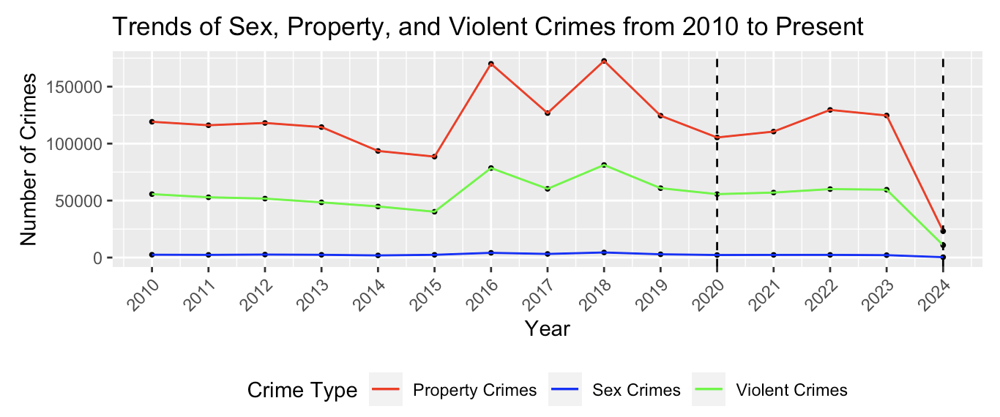

# LA-Crime-Trends-Pre-Post-COVID

A comprehensive data-driven analysis of crime trends in Los Angeles from 2010 to the present, with a particular focus on evaluating the impact of the COVID-19 pandemic on overall crime rates and the distribution of specific crime types (violent, property, and sex crimes).

---

## Overview

This repository comprises an R Markdown document alongside its HTML output, detailing an in-depth analysis of crime trends in Los Angeles over the past decade and beyond. The primary objectives of the analysis include:

- **Data Cleaning and Categorization**: Standardizing raw crime descriptions into uniform categories (violent, property, sex crimes) and eliminating incomplete or inaccurate records to ensure data integrity.
  
- **Statistical Testing**:
  - **Difference-of-Proportions Test**: Assessing changes in the proportion of violent crimes before and after the COVID-19 pandemic.
  - **Welch Two-Sample T-Test**: Comparing the mean monthly crime counts pre-pandemic and post-pandemic to identify significant shifts in overall crime rates.
  
- **Visualization**: Creating time series plots and bar charts to illustrate year-over-year changes and contextualize fluctuations in crime statistics.

This project synthesizes these components to determine whether the COVID-19 pandemic correlates with significant alterations in crime patterns within Los Angeles. The analysis is based on official LAPD records, acknowledging the potential for underreporting and reporting biases inherent in the data.

---

## Analysis Summary

1. **Time Series Examination**
   
   - **Monthly/Yearly Trends**: Time series plots from 2010 to 2024 reveal significant changes in crime rates, including a notable dip around 2020, potentially attributable to pandemic-induced disruptions, changes in policing, or reporting practices.
   - **Consistency Pre- vs. Post-COVID**: An upward trend in crime counts was observed prior to 2018, followed by tapering and fluctuations during the COVID period.

2. **Statistical Testing**
   
   - **Difference of Proportions Test**  
     - **Result**: A statistically significant increase in the proportion of violent crimes post-COVID (30.58%) compared to pre-COVID (29.43%), with a p-value of 9.88e-78 and a 95% confidence interval of [-0.0127, -0.0103].  
     - **Interpretation**: Although the total crime rate remained relatively stable, the relative share of violent crimes increased significantly in the post-pandemic period.
   
   - **Welch Two-Sample T-Test**  
     - **Focus**: Comparing the average monthly total crimes pre-COVID (mean = 16,082.67) and post-COVID (mean = 16,802.67).  
     - **Outcome**: No statistically significant difference was found (p-value = 0.145), with a 95% confidence interval for the difference in means ranging from -214.03 to 1,442.01.  
     - **Implication**: At an aggregate level, the pandemic did not result in a significant change in the average monthly crime counts.

3. **Visualization**
   - **Time Series Plots**: Highlighting trends and disruptions in crime rates over time.
   - **Bar Charts**: Illustrating the change in proportions of specific crime types pre- and post-COVID.

4. **Interpretation**
   - **Overall Crime Rates**: No significant shift in the mean monthly crime rates post-COVID, suggesting stability in total crime counts despite the pandemic.
   - **Composition of Crimes**: A significant increase in the proportion of violent crimes post-COVID indicates a shift in the nature of criminal activities.
   - **Potential Influences**: Factors such as lockdown measures, economic stressors, changes in law enforcement practices, and societal behaviors may have contributed to these observed changes.

---

## Findings

Based on the comprehensive analysis conducted, the following key findings emerged:

1. **Stable Overall Crime Rates**:
   - The Welch Two-Sample T-Test revealed no significant difference in the average monthly crime counts before (mean = 16,082.67) and after the onset of COVID-19 (mean = 16,802.67), with a p-value of 0.145 and a 95% confidence interval of [-214.03, 1,442.01]. This suggests that the pandemic did not substantially alter the overall crime volume in Los Angeles.

2. **Increased Proportion of Violent Crimes**:
   - The Difference of Proportions Test showed a significant increase in the proportion of violent crimes post-COVID (30.58%) compared to pre-COVID (29.43%), with a p-value of 9.88e-78 and a 95% confidence interval of [-0.0127, -0.0103]. This indicates a meaningful shift in the nature of criminal activities during the pandemic period.

3. **Crime Category Trends**:
   - **Property Crimes**: Exhibited a peak around 2018 followed by a steady decline towards 2024.
   - **Sex Crimes**: Maintained the lowest crime rates among the categories with minimal year-to-year variation.
   - **Violent Crimes**: Showed moderate fluctuations, remaining relatively stable with minor peaks and troughs.

4. **Impact of COVID-19 on Crime Reporting**:
   - The pronounced dip in crime counts around 2020 may reflect pandemic-related disruptions, changes in policing strategies, or variations in crime reporting practices rather than an actual decrease in criminal activities.

5. **Data Distribution**:
   - The distribution of total crimes approximates a normal distribution, centered around a mean of 16,082.67 with a standard deviation of 3,138.14, adhering to the Central Limit Theorem due to the large sample size.

---

## Conclusion

The analysis of Los Angeles crime data from 2010 to 2024 provides nuanced insights into the effects of the COVID-19 pandemic on criminal activities within the city. While the overall monthly crime rates did not exhibit a statistically significant change post-pandemic, the proportion of violent crimes increased markedly, indicating a shift in the nature of criminal behavior during this period.

**Key Takeaways**:

- **Overall Stability**: The pandemic did not significantly alter the total number of crimes reported monthly, suggesting resilience in crime rates despite societal disruptions.
  
- **Shift in Crime Composition**: The significant rise in the proportion of violent crimes post-COVID highlights a potential area of concern, warranting targeted interventions and further investigation into underlying causes.
  
- **Potential Influencing Factors**: The changes observed may be influenced by a combination of factors, including economic stress, altered social behaviors, changes in law enforcement practices, and variations in crime reporting mechanisms during the pandemic.

**Implications for Policy and Future Research**:

- **Targeted Interventions**: The increase in violent crimes necessitates focused strategies to address the specific factors contributing to this trend.
  
- **Comprehensive Data Collection**: Extending the post-COVID data window beyond 2024 will enhance the robustness of trend analyses and help in understanding long-term impacts.
  
- **Integration of Socioeconomic Indicators**: Incorporating variables such as unemployment rates, housing instability, and economic downturns could provide deeper insights into the drivers of crime trends.
  
- **Geospatial Analysis**: Mapping crime data at the district or neighborhood level may uncover spatial disparities and inform localized policy interventions.

**Limitations**:

- **Data Window Disparity**: The post-COVID data covers a shorter period (approximately 4 years) compared to the pre-COVID data (10 years), which may affect the robustness of trend comparisons.
  
- **External Factors**: The analysis does not account for other influencing factors such as economic fluctuations, policy changes, or major societal events that may have impacted crime rates.
  
- **Reporting Biases**: Potential underreporting or changes in reporting practices during the pandemic could skew the observed trends.

In summary, while this analysis provides valuable insights into crime rate patterns in Los Angeles, additional research is warranted to fully unpack the complexities underlying these trends. The findings suggest that the COVID-19 pandemic may have influenced the composition of crimes, particularly increasing the proportion of violent crimes, even though it did not significantly alter the overall crime rates. Future studies should adopt a multidisciplinary approach, integrating diverse methodologies and broader datasets, to facilitate a more comprehensive understanding of crime dynamics and inform evidence-based policy formulation.

---

## Further Research

1. **Longer Post-COVID Data Window**  
   - Continued data collection for 2024 and beyond is critical. Early trends could solidify or reverse with more time.  
   - A more balanced time frame (e.g., 10 years pre-pandemic vs. 5+ years post-pandemic) would increase the statistical power of post-COVID inferences.

2. **Socioeconomic Indicators**  
   - Integrating city-level unemployment rates, local business closures, or housing instability could provide a clearer picture of how broader economic factors contribute to crime trends.  
   - Studying correlations between policy changes (e.g., eviction moratoriums, stimulus payments) and crime reports might reveal causal linkages.

3. **Geospatial Analysis**  
   - Mapping crimes by district or neighborhood could uncover spatial disparities.  
   - Identifying hotspots or local contexts (e.g., retail corridors, residential areas) that saw more pronounced shifts during COVID might refine policy interventions.

---

## References

1. **Crime Data from 2010 to 2019**  
   [Crime Data from 2010 to 2019](https://catalog.data.gov/dataset/crime-data-from-2010-to-2019)

2. **Crime Data from 2020 to Present**  
   [Crime Data from 2020 to Present](https://catalog.data.gov/dataset/crime-data-from-2020-to-present)

3. **National Library of Medicine**  
   [NCBI Article on COVID-19-related impacts in Los Angeles](https://www.ncbi.nlm.nih.gov/pmc/articles/PMC7996058/)

---

**Contributors**:  
**Beomseong Kim**, Luis Ylizaliturri, Dein Ikiriko, David Greene

**Disclaimer**: These findings are based on *reported* crime data only. Actual crime levels may differ due to underreporting or variations in local policing and reporting practices.
