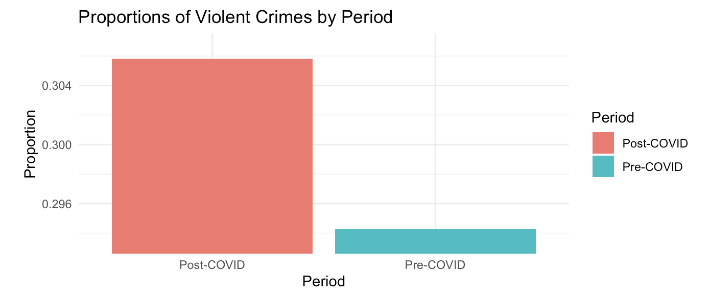

# LA-Crime-Trends-Pre-Post-COVID

A data-focused project investigating crime trends in Los Angeles from 2010 to the present, with special emphasis on analyzing how the COVID-19 pandemic may have influenced both overall crime rates and the proportions of specific crime types (violent, property, and sex crimes).

---

## Overview
This repository contains an R Markdown document and its corresponding HTML output. The analysis concentrates on:
- **Data Cleaning and Categorization**: Converting raw text descriptions into standardized crime categories (violent, property, sex crimes) and removing incomplete or erroneous records.
- **Statistical Testing**: Applying a difference-of-proportions test to measure shifts in violent crime proportions pre- vs. post-pandemic, and a Welch Two-Sample t-test to compare mean monthly crime counts before and after March 2020.
- **Visualization**: Generating time series plots and bar charts to help contextualize year-over-year fluctuations in crime counts.

By combining these elements, the project offers a systematic view of whether the pandemic era aligns with any notable changes in how and what crimes occur across Los Angeles. While these data are drawn from official LAPD records, they remain subject to potential underreporting or reporting biases.

---

## Analysis Summary

1. **Time Series Examination**

   - **Monthly/Yearly Trends**: Visual plots from 2010 to the present highlight overall changes. A pronounced dip around 2020 suggests potential pandemic-related disruptions but may also reflect altered policing or reporting practices.
   - **Consistency Pre- vs. Post-COVID**: Crime counts exhibit an upward trend prior to 2018, followed by some tapering and fluctuations moving into the COVID period.

3. **Statistical Testing**

   - **Difference of Proportions Test**  
     - **Result**: Demonstrates a statistically significant increase in the proportion of *violent* crimes post-COVID compared to pre-COVID.  
     - **Interpretation**: While the total crime rate may not have changed drastically, the relative fraction of crimes categorized as violent appears to have gone up.
   - **Welch Two-Sample T-Test**  
     - **Focus**: Compared the *average monthly total* of reported crimes before and after March 2020.  
     - **Outcome**: No statistically significant difference; the p-value did not meet typical alpha thresholds (e.g., 0.05), and the confidence interval included zero.  
     - **Implication**: When viewed at a macro-level (all crimes combined), the pandemic timeframe did not exhibit dramatic overall swings in the monthly average.

4. **Interpretation**  
   - **No Large-Scale Rate Shift, but Composition Changes**: The difference-of-proportions result indicates the *type* of crime changed post-COVID, even though overall monthly counts did not.  
   - **Potential Influences**: Stay-at-home orders, altered social behaviors, economic stressors, or shifts in law enforcement priorities could have affected both reporting and occurrence of specific crimes.

---

## Further Research
1. **Longer Post-COVID Data Window**  
   - Continued data collection for 2024 and beyond is critical. Early trends could solidify or reverse with more time.  
   - A more balanced time frame (e.g., 10 years pre-pandemic vs. 5+ years post-pandemic) would increase the statistical power of post-COVID inferences.

2. **Socioeconomic Indicators**  
   - Integrating city-level unemployment rates, local business closures, or housing instability could provide a clearer picture of how broader economic factors contribute to crime trends.  
   - Studying correlations between policy changes (e.g., eviction moratoriums, stimulus payments) and crime reports might reveal causal linkages.

3. **Geospatial Analysis**  
   - Mapping crimes by district or neighborhood could uncover spatial disparities.  
   - Identifying hotspots or local contexts (e.g., retail corridors, residential areas) that saw more pronounced shifts during COVID might refine policy interventions.

---

## References
1. **Crime Data from 2010 to 2019**  
   [Crime Data from 2010 to 2019](https://catalog.data.gov/dataset/crime-data-from-2010-to-2019)

2. **Crime Data from 2020 to Present**  
   [Crime Data from 2020 to Present](https://catalog.data.gov/dataset/crime-data-from-2020-to-present)

3. **National Library of Medicine**  
   [NCBI Article on COVID-19-related impacts in Los Angeles](https://www.ncbi.nlm.nih.gov/pmc/articles/PMC7996058/)

---

**Contributor**: 
**Beomseong Kim**, Luis Ylizaliturri, Dein Ikiriko, David Greene

**Disclaimer**:  
These findings are based on *reported* crime data only. Actual crime levels may differ due to underreporting or variations in local policing and reporting practices.
